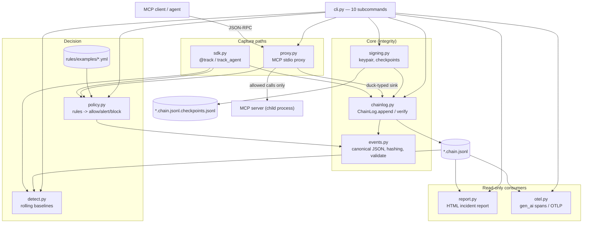
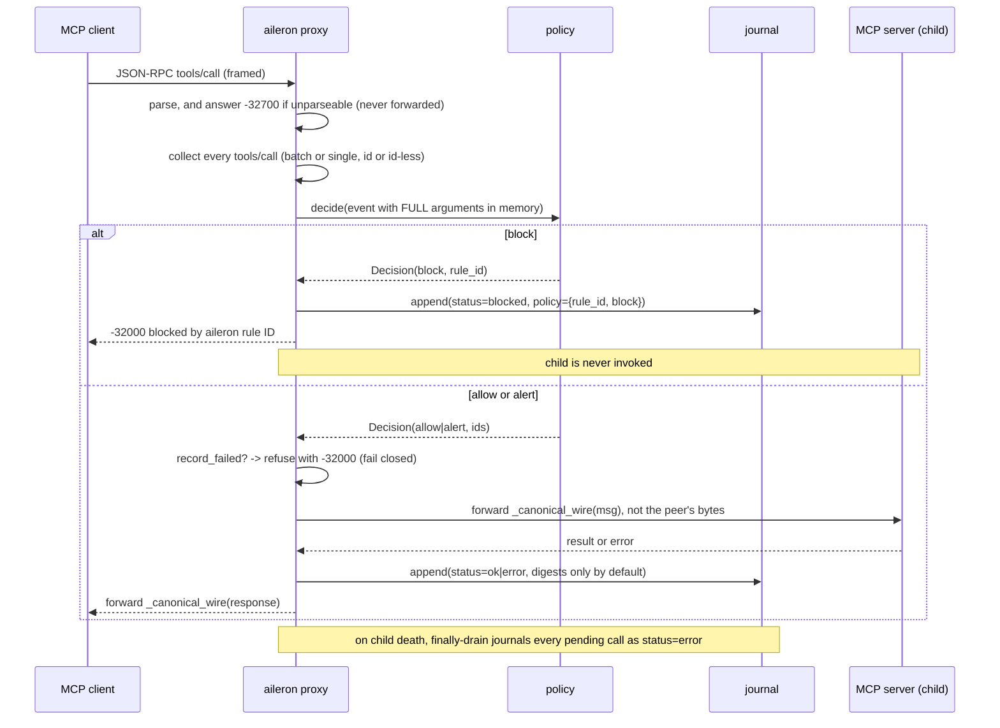
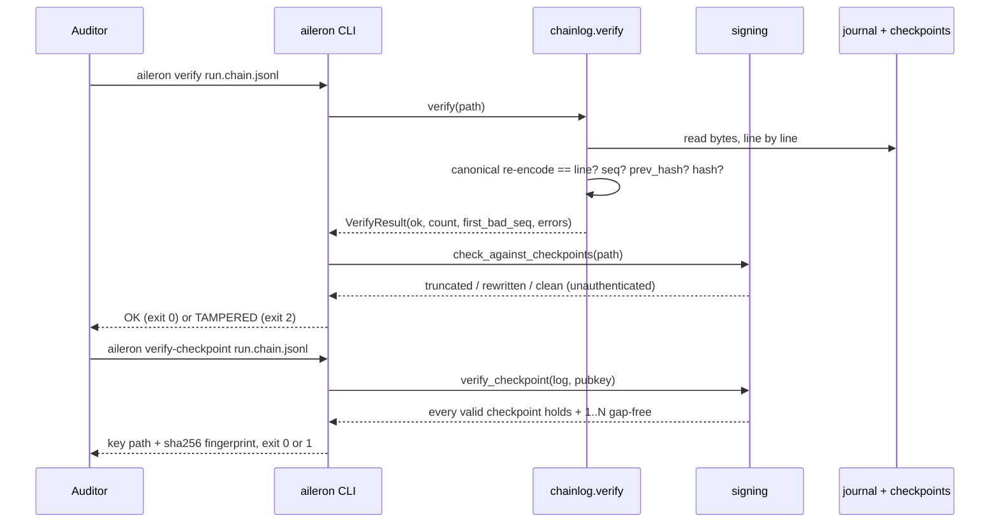

# System Architecture

Generated by AI-DLC Reverse Engineering against git `6c09efd` (Aileron 0.1.3), 2026-08-12.

## System Overview

Aileron is a single Python package (`src/aileron/`, 11 modules, 2,625 lines) that ships both a
library and a console script. There is no server, no database, and no deployed infrastructure: the
unit of persistence is a local append-only JSONL file, and the unit of trust is an Ed25519 keypair
on disk. All verification is offline and self-contained.

The package has two independent capture paths into the same journal format, and this split is the
central architectural decision:

- **In-process (`sdk`)** — a decorator around functions the developer chooses to instrument.
  Convenient, and bypassable by any code path that was not decorated.
- **Out-of-process (`proxy`)** — an MCP stdio proxy between client and tool server. Mediation happens
  in a separate process on the tool-call path, so agent code cannot skip it.

Everything downstream (`verify`, `sign-checkpoint`, `report`, `export`, `detect`) reads the journal
after the fact and does not care which path produced it.

Two invariants shape the layering more than anything else. First, **the bytes on disk are
authoritative**: `verify` re-serialises each parsed event and requires it to equal the line it came
from, so a line that hashes correctly but is not canonically encoded is still tampering. Second,
**enforcement and persistence are decoupled**: producers hand policy the full arguments in memory
while `chainlog.append` strips them to digests, so content rules fire in the default privacy-preserving
mode.

## Architecture Diagram

## Component Descriptions

### `events.py` (218 lines)
- **Purpose**: canonical serialisation, event construction, hashing, schema validation.
- **Responsibilities**: `canonical_json` (sorted keys, `(",", ":")` separators, `ensure_ascii=True`,
  `allow_nan=False`); `new_event` seeding 15 keys and deriving `arguments_digest` / `result_digest`;
  `event_hash` = `sha256(canonical(event minus hash))`; `validate` returning a list of schema errors.
- **Dependencies**: none inside the package. It is the leaf everything else stands on.
- **Type**: Application (core).

### `chainlog.py` (183 lines)
- **Purpose**: the append-only hash-chained journal and its verifier.
- **Responsibilities**: `ChainLog.append` assigns `seq = last + 1`, sets `prev_hash`, computes
  `hash`, and writes one canonical line; it also strips `tool.arguments` and `result` unless
  `capture_content=True`. `verify` is total **with respect to file content** — no hostile bytes make it
  raise — and it checks UTF-8 decodability, JSON parseability, dict-ness, byte-exact canonical
  encoding, sequence continuity, link continuity, and hash correctness. The totality stops at the file
  handle: `open(path, "rb")` is unguarded, so a path that exists but is a directory or is unreadable
  raises `IsADirectoryError` / `PermissionError`, and `cli.main()` does not catch `OSError`. Recorded
  as debt in `code-quality-assessment.md`. After a bad line, a `_BROKEN` sentinel prevents any later event from chaining on.
  `__iter__` is deliberately lenient so a reader can still show a damaged log.
- **Dependencies**: `events`.
- **Type**: Application (core).

### `signing.py` (270 lines)
- **Purpose**: Ed25519 attestation of journal prefixes.
- **Responsibilities**: `generate_keypair` writes the private key `0o600` at `os.open` time with
  `O_NOFOLLOW` (no world-readable window, no symlink following); `sign_checkpoint` refuses to sign a
  broken or empty chain and chains each checkpoint to the previous one via
  `prev_checkpoint_hash`; `verify_checkpoint` requires every valid checkpoint to hold and the valid
  set to form a gap-free `1..N` run; `check_against_checkpoints` (0.1.3) offers an unauthenticated
  cross-check that distinguishes truncation from rewriting.
- **Dependencies**: `chainlog`, `events`, external `cryptography`.
- **Type**: Application (core).

### `policy.py` (202 lines)
- **Purpose**: Sigma-like rule loading and decisions.
- **Responsibilities**: load a file or a name-sorted directory of `.yml` / `.yaml` (sorting is what
  makes "first block wins" deterministic); validate `id`, `match`, `action`; match dotted-key exact,
  `_contains` (case-insensitive, any-of), and `_regex` clauses, all AND-ed; return a `Decision` where
  the first matching `block` short-circuits and otherwise all matching `alert` ids are collected.
- **Dependencies**: `events` (for `canonical_json` when a match target is not a string), external `yaml`.
- **Type**: Application (core).

### `detect.py` (186 lines)
- **Purpose**: rolling behavioural baselines.
- **Responsibilities**: consider only `tool_call` events with a non-empty tool name; `flag` is pure
  and returns strings (`first_seen_tool:`, `rate_spike:`, `novel_sequence:`), `observe` mutates,
  `save`/`load` persist versioned JSON defensively. Rate spike needs ≥5 prior observations and fires
  when the 60-second windowed rate exceeds 3× baseline. Timestamps are capped at 1,000 per tool.
- **Dependencies**: none inside the package; stdlib only.
- **Type**: Application (core).

### `sdk.py` (216 lines)
- **Purpose**: in-process instrumentation.
- **Responsibilities**: `track` decorator (journal the call, evaluate rules on full arguments, raise
  `PolicyBlocked` without invoking the function, optionally run a baseline and emit `alert` events);
  `AgentSession` / `track_agent` bracketing runs with `agent_start` / `agent_end` and propagating
  identity through a `ContextVar`; `default_log()` resolving `AILERON_LOG` once into a process-global
  singleton; error text reduced to the exception class name unless content capture is on.
- **Dependencies**: `events`, `chainlog`, `policy`.
- **Type**: Application (capture path).

### `proxy.py` (428 lines — largest module)
- **Purpose**: framework-agnostic, unskippable mediation of MCP tool calls.
- **Responsibilities**: read both newline-delimited and `Content-Length`-framed JSON-RPC; reject
  ambiguous framing (duplicate or non-numeric `Content-Length`, missing length, >64 MiB, oversized
  header block, header lines failing an RFC 7230 field-name pattern); police *every* `tools/call` in
  a message including batch arrays and id-less notifications; refuse the whole message on a block and
  answer every id in a batch while blaming the matching one; forward `_canonical_wire(msg)` rather
  than the peer's bytes in **both** directions so no raw newline can re-split a frame; bound
  `pending` at 4,096 and fail closed on overflow; journal displaced duplicate ids; set `record_failed`
  and refuse calls when recording is unavailable; drain in-flight calls with `status="error"` in a
  `finally` block; serialise journal writes with a lock shared with the reader thread.
- **Dependencies**: `events`, `policy`. Notably **not** `chainlog` — the sink is duck-typed (`Any`,
  with `capture_content` read via `getattr`), so any object with `append` works.
- **Type**: Application (capture path).

### `otel.py` (209 lines)
- **Purpose**: OpenTelemetry GenAI-aligned export.
- **Responsibilities**: `to_otel_spans`, `to_otlp_spans`, `export_json`; maps event types to
  `gen_ai.operation.name` and attaches `gen_ai.tool.name`, `gen_ai.agent.name`, and
  `aileron.event.hash`.
- **Dependencies**: `__init__` (for `__version__`) only.
- **Type**: Application (read-only consumer).

### `report.py` (183 lines)
- **Purpose**: single-file HTML incident report.
- **Responsibilities**: `render_html` with inline CSS and JS, a `VERIFIED` / `TAMPERED at seq N`
  badge, and a filterable timeline. Every interpolated value is escaped, including the verify-result
  fields in the badge.
- **Dependencies**: `__init__` (for `__version__`) only.
- **Type**: Application (read-only consumer).

### `cli.py` (461 lines)
- **Purpose**: the console-script surface, `aileron`.
- **Responsibilities**: argparse wiring for ten subcommands, a `_DISPATCH` table, exit-code policy,
  disclosure of the resolved verification key path plus a `sha256:` fingerprint (with a stderr
  warning when the key was auto-resolved from the log's own directory), the 0.1.3 checkpoint
  cross-check applied to both `verify` and `report`, and the scripted `demo`. Every sibling module is
  imported lazily inside its command function.
- **Dependencies**: all of them, lazily.
- **Type**: Application (interface). Also the highest-coupling file in the repo.

### `__init__.py` (69 lines)
- **Purpose**: lazy public façade.
- **Responsibilities**: `__version__ = "0.1.3"`; a `__getattr__` that resolves nine public names on
  first access; `bundled_rules_dir()` as the only eagerly defined function.
- **Type**: Application (packaging).

## Data Flow

### Tool call through the MCP proxy (the enforcement path)

### Verification and attestation (the trust path)

## Integration Points

- **External APIs**: none at runtime. The library makes no network calls of any kind, by policy —
  no telemetry, no phone-home. This is a stated product guarantee, not an accident of the build.
- **Databases**: none. Persistence is `*.chain.jsonl` plus an adjacent
  `*.chain.jsonl.checkpoints.jsonl`, and a JSON baseline state file when `detect --save --state` is used.
- **Third-party Services**:
  - **MCP servers** — any stdio server, wrapped as a child process by the proxy.
  - **OpenTelemetry collectors** — indirectly, by exporting OTLP/JSON that the user forwards.
  - **PyPI** — release target, via GitHub Actions trusted publishing (OIDC, no stored tokens).
  - **GitHub Actions** — CI matrix, benchmark regression guard, release pipeline.

## Infrastructure Components

- **CDK Stacks**: none. There is no cloud infrastructure in this repository, which is why most
  resiliency-extension rules resolve to N/A.
- **Deployment Model**: distribute a wheel and an sdist to PyPI; users `pip install aileron`. The
  proxy runs as a local process alongside the agent; the SDK runs in-process. Nothing is hosted.
- **Networking**: none required, including for verification. This is the point: an auditor with the
  journal, the public key, and the CLI needs no connectivity and no trusted third party.
- **CI/CD**: `ci.yml` (8-job matrix: Ubuntu and macOS × Python 3.10–3.13, `fail-fast: false`),
  `benchmark.yml` (path-filtered proxy-overhead guard, fails at >2× baseline median on two
  consecutive runs), `release.yml` (test → build → publish, `environment: pypi`, `id-token: write`).
