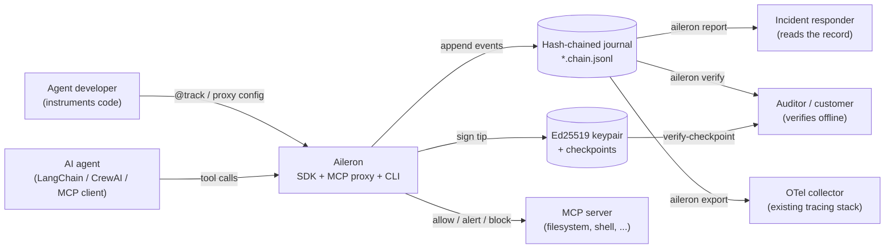

# Business Overview

Generated by AI-DLC Reverse Engineering against git `6c09efd` (Aileron 0.1.3), 2026-08-12.

## Business Context Diagram

## Business Description

- **Business Description**: Aileron is an open-source (Apache-2.0) flight recorder for AI agents. It
  answers one question that ordinary observability cannot: *what did the agent actually touch, and
  can I prove this record was not edited afterwards?* Every tool call an agent makes is appended to
  a SHA-256 hash-chained JSONL journal, optionally attested by Ed25519-signed checkpoints, and
  policy rules can block a dangerous call before it executes. The value proposition is evidence you
  verify offline, not telemetry you have to trust — no network, no server, no third party.

- **Business Transactions** implemented by the system:
  1. **Record an agent action** — an agent invokes a tool; Aileron journals the attempt with
     identity, timing, and content digests, whether the call succeeds, fails, or is refused.
  2. **Enforce a policy on a tool call** — evaluate Sigma-like YAML rules against the full call in
     memory *before* execution, and allow, alert on, or block it. A blocked call never runs; the
     attempt is still recorded.
  3. **Flag anomalous agent behaviour** — compare a call against rolling baselines and raise
     advisory alerts for first-seen tools, rate spikes, and novel tool-call sequences.
  4. **Verify journal integrity** — recompute every hash and link, report the first bad sequence
     number, and exit non-zero so CI or a script can gate on it.
  5. **Attest a journal prefix** — sign the chain tip with Ed25519 so later appends stay valid while
     truncation or rewriting of the signed prefix is detectable, and verify that attestation offline
     using only the public key.
  6. **Investigate an incident** — turn a journal into a single self-contained HTML report with a
     verification badge and a filterable timeline.
  7. **Feed the existing telemetry stack** — export events as OpenTelemetry GenAI-aligned spans so
     Aileron sits beside a tracing stack as the evidence layer rather than replacing it.
  8. **Mediate a third-party tool server** — proxy any MCP stdio server so mediation happens in a
     separate process that agent code cannot skip.

- **Business Dictionary**:
  - **Event** — one journaled fact about an agent: a tool call, an LLM call, a session boundary, a
    policy decision, or an alert. Canonically serialised so its bytes are reproducible.
  - **Chain** — the append-only sequence of events, each carrying `prev_hash` of its predecessor.
    The genesis event links to 64 zeros.
  - **Checkpoint** — an Ed25519 signature over the chain tip plus its count, itself chained to the
    previous checkpoint. Covers a *prefix*, so honest appends never invalidate it.
  - **Rule** — a YAML pattern (exact, substring, or regex over dotted event keys) with an action of
    `allow`, `alert`, or `block`.
  - **Baseline** — persisted behavioural statistics per tool and per session, used to raise advisory
    flags. Never blocks.
  - **Digest-only mode** — the default posture: arguments and results are stored as SHA-256 digests,
    never raw. Rules still see full content in memory, so enforcement is unaffected by what is
    persisted.
  - **Tamper-evident, not tamper-proof** — the chain proves modification after the fact; it does not
    prevent an attacker with write access from rewriting the whole log and forging forward.

## Who the system serves

- **Agent developers** instrument their own tools with `@track` or wrap a session with
  `track_agent`, and get a local record with no infrastructure to stand up.
- **Platform and security engineers** put the MCP proxy in front of tool servers so mediation cannot
  be bypassed by uninstrumented code paths, and so a destructive call is refused rather than merely
  observed.
- **Incident responders** need the timeline after something went wrong, including the calls that
  were refused and the calls that were still in flight when the process died.
- **Auditors and customers** need to verify the record without trusting the party that produced it,
  which is why verification requires no network and no service.

## Component Level Business Descriptions

### `events` — canonical fact format
- **Purpose**: define what a recorded fact *is* and how it is serialised, byte for byte.
- **Responsibilities**: canonical JSON (sorted keys, compact separators, `ensure_ascii=True`,
  no NaN), event construction with digest derivation, hashing, schema validation.

### `chainlog` — the journal and its authority
- **Purpose**: make the record append-only and make modification detectable.
- **Responsibilities**: append with sequence and link assignment, lenient iteration for readers,
  strict total verification for authority, and enforcement of digest-only capture.

### `signing` — attestation
- **Purpose**: raise forgery from "needs write access" to "needs the private key".
- **Responsibilities**: keypair generation with restrictive permissions, checkpoint signing over a
  prefix, chained checkpoints, and offline verification against the public key.

### `policy` — enforcement decisions
- **Purpose**: decide allow / alert / block before a tool runs.
- **Responsibilities**: load and validate YAML rules deterministically, match clauses against the
  full in-memory call, and return a decision where the first matching block wins.

### `detect` — behavioural advisory
- **Purpose**: notice that *this* agent is behaving unlike itself.
- **Responsibilities**: maintain rolling per-tool and per-session baselines, flag first-seen tools,
  rate spikes, and novel transitions, and persist state as JSON. Advisory only, never blocking.

### `sdk` — in-process instrumentation
- **Purpose**: the one-decorator path to a record.
- **Responsibilities**: wrap a callable, journal the attempt, raise on block, bracket sessions with
  start and end events, and redact error text unless content capture is enabled.

### `proxy` — unskippable mediation
- **Purpose**: enforce from outside the agent process.
- **Responsibilities**: speak both JSON-RPC framings, police every `tools/call` including batches
  and notifications, fail closed on anything it cannot parse or record, forward a re-serialisation
  rather than the peer's bytes, and journal in-flight calls when the child dies.

### `otel` — interoperability
- **Purpose**: coexist with the telemetry stack a team already runs.
- **Responsibilities**: map events to `gen_ai.*`-aligned spans and OTLP/JSON.

### `report` — the human answer
- **Purpose**: make the record readable under time pressure.
- **Responsibilities**: render one self-contained HTML file with a verification badge and a
  filterable timeline, escaping every value it interpolates.

### `cli` — the product surface
- **Purpose**: everything above, usable without writing Python.
- **Responsibilities**: ten subcommands, meaningful exit codes, disclosure of which key anchored a
  verification, and a scripted `demo` that proves the value in sixty seconds.
