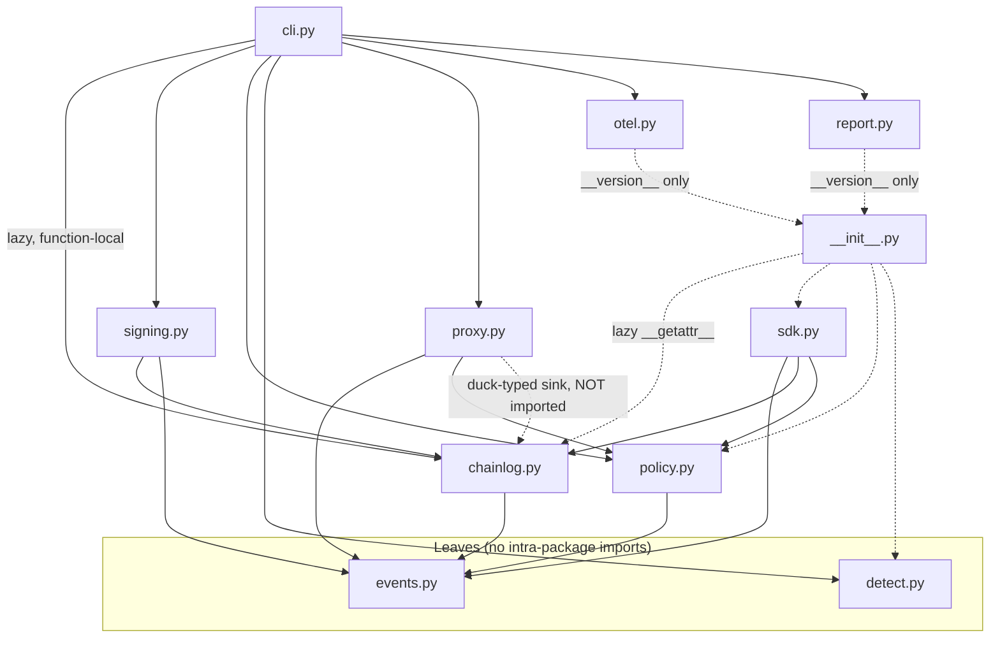

# Code Structure

Generated by AI-DLC Reverse Engineering against git `6c09efd` (Aileron 0.1.3), 2026-08-12.

## Build System

- **Type**: setuptools, PEP 621 metadata in `pyproject.toml` (no `setup.py`).
- **Configuration**:
  - `name = "aileron"`, `version = "0.1.3"`, `requires-python = ">=3.10"`, license Apache-2.0.
  - `src/` layout via `[tool.setuptools.packages.find]`; `py.typed` ships (PEP 561 typed package).
  - Runtime dependencies: `pyyaml`, `cryptography`. Dev extra: `pytest`.
  - Console script: `aileron = "aileron.cli:main"`.
  - Package data: `["py.typed", "rules/examples/*.yml", "rules/examples/*.md"]` are bundled into the
    wheel so `bundled_rules_dir()` and `aileron init` work from an installed package, not just a
    checkout. Note the `*.md` glob — `rate-spike-note.md` *is* shipped in the wheel; it is `aileron
    init` that never copies it out (see code-quality-assessment.md debt item 10).
- **Distribution**: wheel + sdist built by `python -m build`, checked with `twine check`, published
  to PyPI by GitHub Actions via trusted publishing (OIDC).

## Key Modules

The graph is acyclic apart from the deliberate `__init__` façade, and the two leaves matter: because
`events` imports nothing, its `canonical_json` can be trusted as the single definition of "these
bytes"; because `detect` imports nothing, behavioural detection can be reused or replaced without
touching integrity code.

### Existing Files Inventory

Source (`src/aileron/`, 11 files, 2,625 lines):

- `src/aileron/__init__.py` (69) — lazy public façade; `__version__`; `bundled_rules_dir()`.
- `src/aileron/events.py` (218) — canonical JSON, `new_event`, `digest`, `event_hash`, `validate`.
- `src/aileron/chainlog.py` (183) — `ChainLog`, `VerifyResult`, `verify`, digest-only stripping.
- `src/aileron/signing.py` (270) — keypair generation, `sign_checkpoint`, `verify_checkpoint`, `check_against_checkpoints`.
- `src/aileron/policy.py` (202) — `Rule`, `Decision`, `matches`, `decide`, `load_rules`.
- `src/aileron/detect.py` (186) — `Baseline` with `flag` / `observe` / `save` / `load`.
- `src/aileron/sdk.py` (216) — `track`, `AgentSession`, `track_agent`, `PolicyBlocked`, `default_log`.
- `src/aileron/proxy.py` (428) — `run_proxy` and the JSON-RPC framing/mediation internals.
- `src/aileron/otel.py` (209) — `to_otel_spans`, `to_otlp_spans`, `export_json`.
- `src/aileron/report.py` (183) — `render_html` plus inline `_CSS` / `_JS`.
- `src/aileron/cli.py` (461) — `main`, `_build_parser`, `_DISPATCH`, ten `_cmd_*` handlers.
- `src/aileron/py.typed` (0) — PEP 561 marker.
- `src/aileron/rules/examples/destructive-shell.yml` — `aileron-001`, block.
- `src/aileron/rules/examples/secrets-exfil.yml` — `aileron-002`, alert.
- `src/aileron/rules/examples/rate-spike-note.md` — prose on rules versus detection. Note that
  `aileron init` globs `*.yml` only, so this file is not copied into a user's seeded `rules/`.

Tests (`tests/`, 10 files, 2,083 lines, 117 test functions) — one module per source module, each
inserting `../src` on `sys.path`; there is no `conftest.py`:

- `test_events.py` (134, 8 tests) · `test_chainlog.py` (219, 13) · `test_signing.py` (203, 13) ·
  `test_policy.py` (236, 20 defs; one parametrised ×6 → 25 collected) · `test_detect.py` (157, 13) ·
  `test_sdk.py` (199, 8) · `test_proxy.py` (406, 12 — real subprocess children over pipes) ·
  `test_otel.py` (121, 6) · `test_report.py` (138, 6) · `test_cli.py` (270, 18 — calls `main(argv)`).

Supporting:

- `scripts/benchmark.py` — drives an identical MCP child directly and through the proxy, subtracts,
  and enforces regression against a baseline.
- `scripts/benchmark_baseline.json` — recorded medians (0.264 / 0.306 / 0.629 ms at 64 B / 4 KB / 32 KB).
- `examples/langchain_tool_tracking.py` — duck-typed LangChain demo; imports no framework, but does
  import `aileron.policy` (and therefore PyYAML), contrary to its own "stdlib-only" docstring.
- `examples/mcp_proxy_demo.sh` — end-to-end proxy, block, verify shell demo.
- `.github/workflows/{ci,benchmark,release}.yml` — see architecture.md.
- `SPEC.md` — self-described single source of truth; **currently drifted** (see code-quality-assessment.md).
- `README.md`, `CHANGELOG.md`, `CONTRIBUTING.md`, `SECURITY.md`, `LICENSE`.

Untracked or stale in the working tree: `benchmarks/` (contains only a stale `__pycache__` for a
`bench_proxy` module whose source moved to `scripts/benchmark.py`), `dist/`, `src/aileron.egg-info/`,
`.pytest_cache/`.

## Design Patterns

### Canonical serialisation as a single source of truth
- **Location**: `events.canonical_json`, imported by `chainlog`, `signing`, and `policy`.
  Note that `proxy` is **not** in that list: it uses `events.new_event` and `events.digest`, but its
  own `_canonical_wire` is `json.dumps(msg, separators=(",", ":"), ensure_ascii=True)` with **no
  `sort_keys`**. That is deliberate — wire re-serialisation exists to make framing unambiguous, not to
  produce a hashable canonical form, and key order on the wire carries no security meaning.
- **Purpose**: make "the bytes" unambiguous so a hash means something.
- **Implementation**: `json.dumps(obj, sort_keys=True, separators=(",", ":"), ensure_ascii=True,
  allow_nan=False)`. `ensure_ascii=True` is load-bearing beyond aesthetics — it is what lets a lone
  surrogate be hashed instead of raising, which is why `verify` can be total.

### Bytes-on-disk-are-authoritative verification
- **Location**: `chainlog.verify`.
- **Purpose**: defeat forgeries that hash correctly but were not produced by this writer.
- **Implementation**: re-serialise the parsed event and require `canonical_json(ev) == line`. This
  catches duplicate JSON keys (where last-value-wins would otherwise hash fine) and non-canonical
  number literals.

### Poisoned-sentinel chain break
- **Location**: `chainlog._BROKEN`.
- **Purpose**: stop an attacker from truncating at a bad line and re-syncing a forged tail to genesis.
- **Implementation**: after any unusable line, `expected_prev` becomes a sentinel object that no
  event can match, so every later event reports as unverifiable rather than valid.

### Fail-closed mediation
- **Location**: `proxy.run_proxy` and `_read_message`.
- **Purpose**: never let a call through that could not be parsed, policed, or recorded.
- **Implementation**: unparseable JSON gets `-32700` and is never forwarded ("if we cannot parse it
  we cannot police it, and the child's parser may well accept what ours rejected"); ambiguous framing
  raises `ValueError` and tears the session down; a `record_failed` flag is re-checked immediately
  before forwarding and refuses with `-32000`; `pending` overflow is journaled as blocked under a
  pseudo-rule `aileron-pending-limit`.

### Re-serialise, don't relay
- **Location**: `proxy._canonical_wire`, applied in both directions.
- **Purpose**: prevent frame-splitting and smuggling where the child's parser disagrees with ours.
- **Implementation**: forward the compact, `ensure_ascii=True` re-encoding of what was policed, not
  the peer's original bytes. Introduced as the critical fix in 0.1.2.

### Enforcement / persistence separation
- **Location**: producers (`sdk.track`, `proxy`) attach full arguments; `chainlog.append` strips them.
- **Purpose**: keep content rules effective while defaulting to storing only digests.
- **Implementation**: `capture_content` gates persistence only. Both producers document that policy
  and detection see the full call in memory at decision time.

### Duck-typed sink
- **Location**: `proxy.run_proxy(log: Any)`, `getattr(log, "capture_content", False)`.
- **Purpose**: let the proxy journal into anything with `append`, and keep `proxy` off `chainlog`.
- **Trade-off**: flexibility bought at the cost of static guarantees about the sink.

### Lazy façade
- **Location**: `__init__.__getattr__`, and every import inside `cli.py`'s command functions.
- **Purpose**: fast import, and a partial or broken environment still runs unaffected commands.

### Verifier that is total over file content
- **Location**: `chainlog.verify`.
- **Purpose**: a verification tool that crashes on malicious input is a denial-of-service vector.
- **Implementation**: byte-level reads, guarded `canonical_json` and `event_hash`, and
  `RecursionError` from `json.loads` treated as tampering rather than propagated.
- **Limit**: the guarantee covers content, not the file handle. `open(path, "rb")` is unguarded, so a
  directory or an unreadable path raises `OSError`, which `cli.main()` does not catch. See debt item 6
  in `code-quality-assessment.md`.

### Chained checkpoints over a prefix
- **Location**: `signing.sign_checkpoint` / `verify_checkpoint`.
- **Purpose**: allow honest appends after signing while detecting truncation or rewriting of the
  signed prefix, and prevent reordering or deletion from rolling back coverage.
- **Implementation**: each checkpoint carries a 1-based `index` and `prev_checkpoint_hash`; all
  signatures are verified before any is trusted; the valid set must form a gap-free `1..N` run; and
  every valid checkpoint must still hold against the log.

### Secure-by-construction key files
- **Location**: `signing.generate_keypair`.
- **Purpose**: no window in which a private key is world-readable, and no symlink redirection.
- **Implementation**: `os.open` with `O_WRONLY|O_CREAT|O_TRUNC|O_NOFOLLOW` and mode `0o600` at
  creation (`0o644` for the public key). `O_TRUNC` rather than `O_EXCL` keeps `aileron init` idempotent.

### Anti-pattern present: single-file CLI god module
- **Location**: `cli.py` (461 lines, ten handlers, `_build_parser`, `_DISPATCH`, plus a ~100-line
  `_cmd_demo`).
- **Consequence**: it is the collision point for any two parallel workstreams, and `main()`
  special-cases the `rules` group outside `_DISPATCH`, so adding a second `rules` subcommand means
  touching dispatch as well as the parser. Flagged as the primary structural risk for parallel units.

## Critical Dependencies

### PyYAML
- **Version**: unpinned (`pyyaml`).
- **Usage**: `policy._load_rule_file` parses rule YAML.
- **Purpose**: rules are user-authored configuration; YAML is the Sigma-adjacent expectation.
- **Note**: loading must remain a safe load — rule files are configuration, and a community rule repo
  is on the roadmap, which raises the stakes on parser behaviour.

### cryptography
- **Version**: unpinned (`cryptography`).
- **Usage**: Ed25519 key generation, signing, and verification in `signing.py`.
- **Purpose**: attestation. It is a hard dependency, which is why the `ImportError` guard in
  `cli.py:123` is marked `# pragma: no cover`.

### pytest (dev only)
- **Version**: unpinned, `[project.optional-dependencies] dev`.
- **Usage**: the entire suite; CI runs `python -m pytest tests/ -q`.

### Standard library, load-bearing
- `json` (canonicalisation), `hashlib` (SHA-256), `subprocess` + `threading` (proxy),
  `contextvars` (session identity), `argparse` (CLI), `dataclasses`, `re`, `os`, `base64`, `html`.
