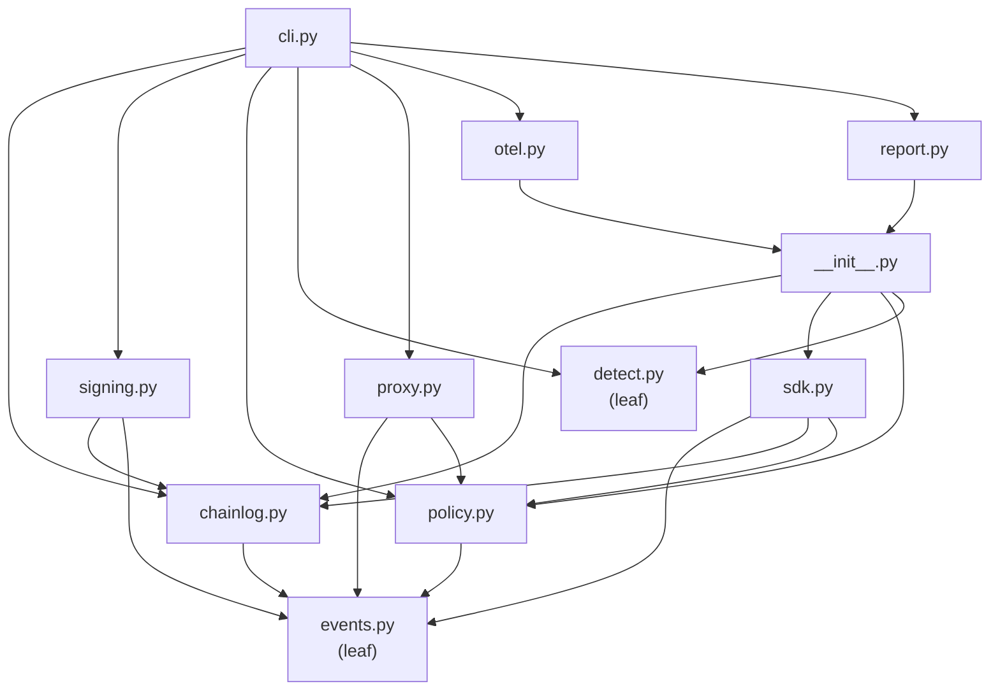

# Dependencies

Generated by AI-DLC Reverse Engineering against git `6c09efd` (Aileron 0.1.3), 2026-08-12.

## Internal Dependencies

The graph is acyclic apart from the `__init__` façade, which is safe only because the façade resolves
lazily through `__getattr__` and `cli` imports every sibling inside its command functions rather than
at module scope.

### `chainlog` depends on `events`
- **Type**: Runtime (compile-time import).
- **Reason**: `canonical_json` and `event_hash` define what a journal line *is*. The journal cannot
  own that definition without duplicating it.

### `policy` depends on `events`
- **Type**: Runtime.
- **Reason**: `canonical_json` is the haystack for `_contains` and `_regex` clauses when the matched
  value is not already a string, so pattern matching sees the same bytes the journal would.

### `signing` depends on `chainlog` and `events`
- **Type**: Runtime.
- **Reason**: a checkpoint attests a verified prefix, so signing must run `chainlog.verify` first and
  refuse a broken or empty chain; `canonical_json` produces the signed payload.

### `sdk` depends on `events`, `chainlog`, `policy`
- **Type**: Runtime.
- **Reason**: the decorator constructs an event, decides on it with full arguments in memory, and
  appends it — the three responsibilities it composes.

### `proxy` depends on `events` and `policy` — *not* on `chainlog`
- **Type**: Runtime.
- **Reason**: deliberate. The sink is duck-typed (`log: Any`, `capture_content` read via `getattr`),
  so the proxy can journal into any object exposing `append`. This keeps mediation independent of the
  concrete journal implementation, at the cost of static guarantees about the sink.

### `otel` and `report` depend only on `__init__`
- **Type**: Runtime, for `__version__` alone.
- **Reason**: both are pure read-only renderers over a list of event dicts. Keeping them ignorant of
  `chainlog` is what makes them trivially testable and reusable.

### `cli` depends on everything, lazily
- **Type**: Runtime, function-local imports.
- **Reason**: fast startup and graceful degradation — a broken or partially installed module only
  affects the subcommands that need it.

### `detect` depends on nothing
- **Type**: —
- **Reason**: behavioural baselining is stdlib-only and consumes plain event dicts, so it can be
  replaced or reused without touching integrity code.

## External Dependencies

### PyYAML
- **Version**: unpinned (`pyyaml` in `[project] dependencies`).
- **Purpose**: parse policy rule files.
- **Used in**: `policy._load_rule_file`.
- **License**: MIT.
- **Risk note**: rule files are trusted configuration today, and a community rule repository is on
  the roadmap. Loading must stay on the safe loader, and rule ingestion from untrusted sources would
  warrant explicit review before that roadmap item ships.

### cryptography
- **Version**: unpinned (`cryptography` in `[project] dependencies`).
- **Purpose**: Ed25519 keypair generation, signing, and signature verification.
- **Used in**: `signing.py` throughout.
- **License**: dual-licensed Apache-2.0 OR BSD-3-Clause.
- **Risk note**: a hard dependency, which is why `cli.py`'s `ImportError` guard is marked
  `# pragma: no cover`. It is also the only dependency carrying compiled code, so it is the main
  wheel-availability constraint across the CI matrix.

### pytest
- **Version**: unpinned (`[project.optional-dependencies] dev`).
- **Purpose**: the test suite.
- **License**: MIT.

### GitHub Actions (build-time only)
- `actions/checkout`, `actions/setup-python`, `actions/upload-artifact`,
  `actions/download-artifact`, `pypa/gh-action-pypi-publish@release/v1`.
- **Purpose**: CI matrix, benchmark guard, and PyPI publication via OIDC trusted publishing.
- **Risk note**: actions are referenced by tag rather than by commit SHA. SHA-pinning is the usual
  hardening step for supply-chain integrity in a security-tooling repository.

### Standard library (load-bearing, no external equivalent needed)
`json`, `hashlib`, `base64`, `os`, `re`, `subprocess`, `threading`, `contextvars`, `argparse`,
`dataclasses`, `pathlib`, `html`, `uuid`, `datetime`, `time`.

## Dependency Posture Summary

Two runtime dependencies, both widely audited, both required for a distinct and irreducible reason
(YAML parsing, Ed25519). Nothing is vendored. There is no lock file, no SBOM, and no dependency
scanning in CI, and the two runtime dependencies plus all GitHub Actions are unpinned — the main
supply-chain gaps for a project whose value proposition is trustworthy evidence.
