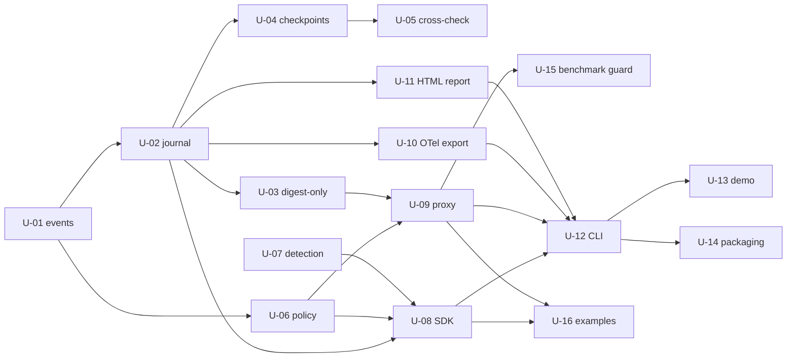

# Existing Feature → Candidate Units of Work

Generated by AI-DLC Reverse Engineering against git `6c09efd` (Aileron 0.1.3), 2026-08-12.

## Status of this document — read before using it

This is **not** an upstream AI-DLC artifact, and it is **not** the output of the Units Generation
stage. Units Generation is gated behind Requirements Analysis and Application Design, and running it
without a change request would invert the workflow's own ordering — the exact "let the agent cook
without program design" failure the agentic engineering principles warn about.

What this document *is*: a brownfield inventory of the sixteen features that already ship, expressed
in unit-of-work shape, so that when a real change request arrives, Units Generation has a grounded
starting point instead of re-deriving the map. Treat every entry as a **candidate unit**, and treat
the collision analysis at the end as the part with immediate practical value.

When Units Generation does run, its outputs belong in
`aidlc-docs/inception/application-design/unit-of-work.md`,
`unit-of-work-dependency.md`, and `unit-of-work-story-map.md` — not here.

## Candidate units

### U-01 · Canonical event schema and hashing
- **Modules**: `events.py` (sole owner)
- **Tests**: `tests/test_events.py` (8)
- **Boundary**: defines what a recorded fact is and how its bytes are produced.
- **Blast radius**: total. Any change to `canonical_json` changes every hash that has ever been
  produced — precisely what the 0.1.1 breaking change did. Treat edits here as a format migration
  with a changelog entry, never as a refactor.

### U-02 · Hash-chained append-only journal
- **Modules**: `chainlog.py` → `events.py`
- **Tests**: `tests/test_chainlog.py` (13)
- **Boundary**: `ChainLog.append`, lenient iteration, and the total `verify`.
- **Note**: the reader/authority split is intentional and documented in the module; keep it.

### U-03 · Digest-only content capture (privacy posture)
- **Modules**: enforced in `chainlog.append`; the "policy still sees full content" half lives in
  `sdk.py` and `proxy.py`
- **Tests**: `test_chainlog.py`, `test_sdk.py` (2 tests), `test_proxy.py` (1 test asserting `"rm -rf"`
  never reaches the file)
- **Boundary**: spans three modules by design.
- **Risk**: the feature most likely to be broken by an unrelated edit to either producer, because the
  guarantee is a *collaboration* between them rather than a single code path.

### U-04 · Ed25519 signed checkpoints
- **Modules**: `signing.py` → `chainlog.py`, `events.py`; surfaced by `cli` `init`,
  `sign-checkpoint`, `verify-checkpoint`
- **Tests**: `tests/test_signing.py` (13)
- **Boundary**: keypair generation, prefix attestation, chained checkpoints, offline verification.

### U-05 · Checkpoint cross-check on `verify` and `report`
- **Modules**: `signing.check_against_checkpoints` + `cli._checkpoint_problems` + `--skip-checkpoint-check`
- **Tests**: `tests/test_cli.py` (5)
- **Boundary**: unauthenticated truncation/rewrite detection without a key present.
- **Shares**: `signing.py` with U-04, `cli.py` with everything.

### U-06 · Policy rule engine
- **Modules**: `policy.py` + `rules/examples/*.yml`
- **Tests**: `tests/test_policy.py` (20 defs / 25 collected, including the rule-wellformedness test)
- **Consumers**: `sdk`, `proxy`, `cli rules test`, `cli demo`
- **Open debt inside this unit**: `action: allow` is inert and `severity_gte` cannot fire.

### U-07 · Behavioural anomaly detection
- **Modules**: `detect.py` (no intra-package imports)
- **Tests**: `tests/test_detect.py` (13)
- **Boundary**: advisory flags only; nothing here can block. The cleanest unit to work on in
  parallel — it collides with nothing except `cli detect`.

### U-08 · SDK instrumentation
- **Modules**: `sdk.py` → `events`, `chainlog`, `policy`
- **Tests**: `tests/test_sdk.py` (8)
- **Composes**: U-02, U-03, U-06, U-07.
- **Known gaps**: no test for the `default_log()` / `AILERON_LOG` path or `_jsonable`'s repr fallback.

### U-09 · MCP stdio proxy interception and enforcement
- **Modules**: `proxy.py` → `events`, `policy` (deliberately not `chainlog`)
- **Tests**: `tests/test_proxy.py` (12, with real subprocess children)
- **Boundary**: the largest unit (428 lines) and the only one with concurrency and subprocess
  lifecycle. Holds the most untested invariants; see `code-quality-assessment.md`.
- **Recommendation**: the natural first unit for any hardening work, and the one where a design doc
  should precede code.

### U-10 · OTel GenAI / OTLP-JSON export
- **Modules**: `otel.py` + `cli export`
- **Tests**: `tests/test_otel.py` (6)
- **Boundary**: read-only over recorded events. Low risk, easily parallelised.

### U-11 · HTML incident report
- **Modules**: `report.py` + `cli report`
- **Tests**: `tests/test_report.py` (6)
- **Boundary**: read-only; consumes a `VerifyResult`. All interpolation escaped, including badge fields.

### U-12 · CLI surface
- **Modules**: `cli.py`
- **Tests**: `tests/test_cli.py` (18)
- **Boundary**: ten subcommands and the exit-code policy.
- **Risk**: highest collision risk in the repo — nine of the sixteen units touch this file, i.e. eight
  besides U-12 itself. Splitting it is recommended *before* parallel work, not after.

### U-13 · Scripted `demo`
- **Modules**: `cli._cmd_demo` (~100 lines inside `cli.py`)
- **Tests**: `test_cli.py::test_demo_builds_chain_and_report`
- **Depends on**: U-02, U-03, U-06, U-07, U-11 and on `bundled_rules_dir()` resolving.
- **Note**: this is the sixty-second first-impression path for every new user, so a regression here
  costs adoption disproportionately. Good candidate to extract from `cli.py` first.

### U-14 · Packaging and bundled rules
- **Modules**: `pyproject.toml`, `__init__.py` (`bundled_rules_dir`, lazy `__getattr__`), `py.typed`,
  package-data globs
- **Tests**: `test_cli.py::test_init_seeds_example_rules`, `test_policy.py` rule-wellformedness
- **Known gap**: `aileron init` globs `*.yml`, so `rate-spike-note.md` is never delivered.

### U-15 · Proxy performance benchmark and CI regression guard
- **Modules**: `scripts/benchmark.py`, `scripts/benchmark_baseline.json`, `.github/workflows/benchmark.yml`
- **Tests**: none (the guard *is* the test); enforced in CI at 2× baseline median with retry-once
- **Coupled to**: `proxy.py`'s latency, not its API. Editing U-09 can fail this unit without touching it.

### U-16 · Framework and usage examples
- **Modules**: `examples/langchain_tool_tracking.py`, `examples/mcp_proxy_demo.sh`
- **Tests**: none
- **Boundary**: adoption surface. Stated in `CONTRIBUTING.md` as one of the two preferred
  contribution types, alongside new detection rules.

## Shared-module collision map

Read this before parallelising anything.

| File | Units touching it |
|---|---|
| `cli.py` | U-04, U-05, U-06, U-07, U-09, U-10, U-11, U-12, U-13 |
| `events.py` | U-01, U-02, U-03, U-06 |
| `chainlog.py` | U-02, U-03, U-04 |
| `signing.py` | U-04, U-05 |
| `proxy.py` | U-03, U-09, U-15 |
| `sdk.py` | U-03, U-08 |

Practical consequences:

- **`cli.py` must be serialised or split.** Two units that each add a subcommand will conflict, and
  `main()`'s special case for the `rules` group means the conflict is in dispatch logic, not just in
  the parser.
- **U-01 is a stop-the-world unit.** It cannot run concurrently with anything that produces or
  verifies events, which is nearly everything.
- **U-03 needs a guard test, not a design doc.** Because it is a three-module collaboration, the way
  to protect it during parallel work is a test that fails loudly if either producer stops handing full
  arguments to policy while the journal stops stripping them.
- **U-07, U-10, U-11 are the safe parallel set.** Each is effectively single-module and read-only or
  self-contained; they touch `cli.py` only at their own handler.

## Suggested dependency ordering for future work

